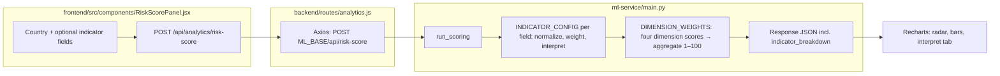

# TradeAI — Technical explanation (by feature and by file)

This document describes how the **TradeAI** repository is structured, how the three runtimes cooperate, and what each important file is responsible for. It is meant as a companion to `README.md` and `REQUIREMENTS_COVERAGE.md`.

---

## 1. System architecture

| Layer | Technology | Role |
|--------|------------|------|
| **Frontend** | React 19, Vite, React Router, Tailwind CSS, Recharts, Axios | Single-page UI; calls the backend at `http://localhost:5000/api` (hardcoded in several components). |
| **Backend** | Node.js, Express 5, Mongoose, MongoDB Atlas | REST API, auth, persistence, aggregations, Stripe payments, PDF generation, **proxy** to the ML service. |
| **ML service** | Python, FastAPI, scikit-learn, NumPy | Risk scoring, batch scoring, interpretability payload, volume forecast, price-volatility statistics. Default URL assumed by backend: `http://127.0.0.1:8000`. |

**Request flow (typical):**

1. Browser → Express route (e.g. `/api/analytics/...`).
2. Express reads/writes MongoDB via Mongoose models, or forwards JSON to FastAPI with Axios.
3. FastAPI returns structured JSON; Express may merge DB-derived series (e.g. forecasts) before responding.

**Operational note:** Features that depend on ML (risk score, breakdown, volume forecast, price volatility, advisory risk branch) degrade gracefully or show errors if `ml-service` is not running.

---

## 2. Feature → implementation map (brief)

| Feature area | What it does | Primary backend | Primary frontend | ML |
|--------------|--------------|-----------------|------------------|-----|
| **Dashboard KPIs & charts** | Top exporters/importers from trade data | `routes/analytics.js` (`GET /dashboard`), `services/dashboardStats.js` | `pages/Dashboard.jsx`, `components/StatCard.jsx` | — |
| **PDF trade summary** | Download PDF aligned with dashboard aggregates | `routes/reports.js` (pdfkit) | `Dashboard.jsx` (blob download) | — |
| **Country trade analytics** | Per-country import/export totals or monthly series | `routes/analytics.js` (`GET /country/:code`) | (consumable by any client; core UI is dashboard/compare) | — |
| **Trade balance time series** | Export/import/balance by year-month, optional filters | `routes/analytics.js` (`GET /trade-balance`) | — | — |
| **Comparative analysis** | Two countries over time; optional commodity filter | `routes/analytics.js` (`GET /compare`) | `pages/ComparativeAnalysis.jsx` | — (batch risk API exists for other clients / future UI) |
| **Commodity price trends** | Line chart from `priceHistory` | `routes/commodities.js` | `pages/CommodityTrends.jsx` | — |
| **Risk score (single)** | Aggregate risk 1–100 from macro indicators | `routes/analytics.js` (`GET /risk/:country`, `POST /risk-score`) | `components/RiskScorePanel.jsx` | `POST /api/risk-score` |
| **Risk breakdown (explain)** | Per-indicator contributions and narrative | `routes/analytics.js` (`POST /risk/:country/breakdown`) | `components/RiskBreakdownPanel.jsx` | `POST /api/risk/{code}/breakdown` |
| **Batch risk** | Up to 20 countries in one call | `routes/analytics.js` (`POST /risk-score/batch`) | Used from comparative / risk flows as needed | `POST /api/risk-score/batch` |
| **Volume forecast** | Monthly volumes from `TradeRecord` → horizon forecast | `routes/analytics.js` (`POST /forecast/volume`), `services/forecastData.js` | `pages/Forecasts.jsx` | `POST /api/forecast/trade-volume` |
| **FX volatility (real data)** | Log-return std from historical FX series | `routes/analytics.js` (`POST /forecast/price-volatility`, `GET /fx/pairs`), `models/FxRate.js`, `scripts/syncFxRates.js` | `pages/Forecasts.jsx` (FX pair selector) | `POST /api/forecast/price-volatility` |
| **RFQ marketplace** | RFQ creation, quoting, awarding, deal settlement tracking | `routes/marketplace.js`, `models/MarketplaceRfq.js`, `models/MarketplaceQuote.js`, `models/Order.js` | `pages/Orders.jsx` (RFQ Board + My Deals) | — |
| **Rule-based advisory** | Recommendations from risk + macro + optional volatility | `routes/advisory.js`, `services/advisoryRules.js` | `pages/Advisory.jsx` | Risk branch via `POST /api/risk-score` |
| **Profitability / landed-cost simulation** | Deterministic calculators (tariff, CIF, duty, FX) | `routes/simulation.js` | `pages/Simulation.jsx` | — |
| **Orders & anomalies** | CRUD orders; flag outliers vs history and list price | `routes/orders.js`, `services/orderAnomaly.js`, `models/Order.js` | `pages/Orders.jsx` | — |
| **Alerts UI** | Lists orders with `isAnomaly: true` | `routes/orders.js` (`GET /anomalies`) | `pages/Alerts.jsx`, badge polling in `Navbar.jsx` | — |
| **Auth** | Register/login/JWT with role-aware accounts (`buyer`/`seller`/`admin`) | `routes/auth.js`, `middleware/auth.js`, `models/User.js` | AuthContext + login/register pages | — |
| **Stripe premium** | Checkout session, webhook tier upgrade, demo bypass | `routes/payment.js` | `pages/Premium.jsx`, `PaymentSuccess.jsx`, `PaymentCancel.jsx` | — |
| **Master data CRUD** | Countries, commodities, trade records (admin for writes) | `routes/countries.js`, `commodities.js`, `trade.js` | Dropdowns across multiple pages | — |
| **Seed data** | Sample countries, commodities, synthetic trade rows | `seed.js` | — | — |

---

## 3. Backend — file by file

### Entry and wiring

| File | Purpose |
|------|---------|
| `backend/server.js` | Sets Cloudflare/Google DNS before other requires (MongoDB Atlas connectivity). Loads `dotenv`, Express, `helmet`, `cors`, JSON body parser, rate-limited `/api/auth`, connects Mongoose, mounts all route modules under `/api/*`, listens on `PORT` or 5000. |

### HTTP routes (`backend/routes/`)

| File | Endpoints (concept) | Notes |
|------|---------------------|--------|
| `auth.js` | `POST /register`, `POST /login`, `GET /me` | `express-validator`, `bcryptjs`, JWT via `JWT_SECRET`; registration supports buyer/seller role and optional admin invite code. |
| `countries.js` | Public `GET`; admin `POST`/`PUT`/`DELETE` with `requireAuth` + `requireAdmin` | Backed by `Country` model. |
| `commodities.js` | Same pattern for commodities | Includes optional `priceHistory` arrays. |
| `trade.js` | Public `GET` trade records; admin mutations | `TradeRecord` model; validates `reporter`, `partner`, `import`/`export`, ISO dates, Mongo IDs. |
| `analytics.js` | Dashboard, trade-balance, country analytics, risk proxies, forecasts, compare, FX pair discovery, data-health | Uses `axios` to `ML_BASE` (`127.0.0.1:8000`). Dashboard supports verified-data fallback; includes `/api/analytics/data-health` freshness endpoint. |
| `marketplace.js` | RFQ and quote lifecycle APIs + authz rules | Enforces JWT identity (`req.auth.sub`), role checks (buyer/seller/admin), ownership checks (RFQ owner for state/accept), and party-scoped settlement updates. |
| `orders.js` | `GET /`, `GET /:id`, `POST /`, `PUT /:id`, `DELETE /:id`, `GET /anomalies` | On create, calls `evaluateSimulatedOrder` to set `isAnomaly` / `anomalyReason`. |
| `payment.js` | `POST /create-session` (Stripe Checkout), `POST /demo-upgrade` (gated by `DEMO_PAYMENT=true`), `POST /webhook` (raw body, signature verify) | Updates `User.tier` to `premium` on successful payment or demo. |
| `simulation.js` | `POST /profitability`, `POST /landed-cost` | Pure functions; validates numeric inputs and clamps duty/tariff rates. |
| `reports.js` | `GET /trade-summary` | Streams a PDF (`pdfkit`) with top exporter/importer lines; same numbers as `getDashboardAggregates`. |
| `advisory.js` | `POST /recommend` | Loads country (+ optional commodity), optionally calls ML risk, computes `logReturnSampleStd` from `priceHistory`, returns `buildRecommendations` list. |

### Mongoose models (`backend/models/`)

| File | Schema highlights |
|------|-------------------|
| `User.js` | `email` unique, hashed `password`, `tier` (`free`/`premium`), `role` (`buyer`/`seller`/`admin` + legacy `user`), optional `stripeCustomerId`. |
| `Country.js` | `code` unique, `region`, `GDP`, `inflation`, `tradeBalance` (USD billions in seed/docs). |
| `Commodity.js` | `name`, `category`, `unit`, `currentPrice`, embedded `priceHistory[]` `{ date, price }`. |
| `FxRate.js` | FX pair store with `pair`, `baseCurrency`, `quoteCurrency`, `currentRate`, `history[]`, `asOf`, `source`, `verified`. |
| `TradeRecord.js` | **Normalized bilateral flow:** `reporter`, `partner` (Country refs), `commodity`, `type` (import/export **from reporter’s perspective**), `volume`, `value`, `date`. |
| `MarketplaceRfq.js` | RFQ metadata, route countries, quantity/unit/incoterm, state lifecycle (`draft/open/bidding/selection/completed/cancelled`). |
| `MarketplaceQuote.js` | Quote records for each RFQ with offer price, lead time, validity, anomaly flags, and score breakdown fields. |
| `Order.js` | Includes legacy/manual orders and RFQ deals with `source`, `rfqId`, `quoteId`, buyer/seller refs, `settlementStatus`, anomaly fields. |

### Services (`backend/services/`)

| File | Responsibility |
|------|----------------|
| `dashboardStats.js` | `getDashboardAggregates()` — top 5 countries by export/import; verified-data-first with all-record fallback metadata. |
| `forecastData.js` | Builds series for ML with official-first + fallback matching, frequency detection (annual/monthly), and metadata (`sourceFrequency`, `isInterpolated`, `expansionNote`, `sourceNote`). |
| `advisoryRules.js` | `logReturnSampleStd(prices)`, `buildRecommendations(signals)` — threshold-based strings (risk band, deficit, inflation, volatility). |
| `orderAnomaly.js` | `evaluateSimulatedOrder` — hard cap on quantity, deviation from `currentPrice`, implied unit-price stats from historical trade, volume percentile heuristics; returns human-readable reasons. |

### Middleware

| File | Responsibility |
|------|----------------|
| `middleware/auth.js` | `requireAuth` (Bearer JWT), `requireAdmin`, `requireRole`, `attachUser` (loads user without password). |

### Scripts and config

| File | Purpose |
|------|---------|
| `seed.js` | Same DNS preamble as server; wipes and repopulates countries, commodities, and many `TradeRecord` rows (randomized) for demos. |
| `scripts/syncFxRates.js` | Pulls real FX history from Yahoo Finance and upserts `FxRate` records for forecast usage. |
| `scripts/verifyMarketplaceFlow.js` | End-to-end RFQ->quote->accept->settlement verification using JWT roles. |
| `scripts/verifyMarketplaceGuards.js` | Guard validation for invalid state transitions and closed-RFQ bid blocking. |
| `package.json` | Express stack: mongoose, axios, stripe, pdfkit, jwt, bcrypt, helmet, rate-limit, validators. |
| `.env` | **Not committed** — `MONGO_URI`, `JWT_SECRET`, Stripe keys, `DEMO_PAYMENT`, etc. |
| `.env.example` | Template for required variables (including `DEMO_PAYMENT`). |

---

## 4. ML service — file by file

| File / area | Purpose |
|-------------|---------|
| `ml-service/main.py` | FastAPI app, CORS open, Pydantic models for requests. |
| `MacroIndicators` / `RiskScoreRequest` | Typed indicator payload; missing fields get neutral scoring in `run_scoring`. |
| `INDICATOR_CONFIG` + `DIMENSION_WEIGHTS` | Per-indicator normalization (MinMax to 0–100), inversion flags, grouping into four dimensions, weighted aggregate risk. |
| `POST /api/risk-score` | Single-country score + full breakdown embedded in result. |
| `POST /api/risk-score/batch` | Max 20 payloads; used for comparative / bulk scenarios. |
| `POST /api/risk/{country_code}/breakdown` | Validates URL code matches body; returns dimension scores + `indicator_breakdown` for UI explainability. |
| `POST /api/forecast/trade-volume` | Feature autoregression (lags + rolling features + optional exogenous trend inputs), with 80/95 bands and backtest metrics; naive fallback if the series is too short. |
| `POST /api/forecast/price-volatility` | Log returns, sample standard deviation, optional rolling window stats. |
| `ml-service/requirements.txt` | Pins FastAPI, uvicorn, sklearn, numpy, pydantic, etc. |

### 4.1 Risk score and risk interpretability (end-to-end flow)

Scoring and explainability use the same core function, `run_scoring()`, in `ml-service/main.py`. Express does not re-implement the math; it forwards JSON to FastAPI. The default ML base URL in `backend/routes/analytics.js` is `http://127.0.0.1:8000` (`ML_BASE`).

**Risk score:** `RiskScorePanel.jsx` posts to `POST /api/analytics/risk-score` with a body like `{ country_code, country_name, indicators: { ... } }` (all indicator keys optional; missing values are treated as neutral in `run_scoring`). The response includes `aggregate_risk_score`, per-dimension scores, and `indicator_breakdown`.

**Risk interpretability:** `RiskBreakdownPanel.jsx` posts to `POST /api/analytics/risk/:country/breakdown` with the same shape; the path segment must match `country_code` in the body. The ML route `POST /api/risk/{country_code}/breakdown` returns `dimension_scores`, `dimension_weights`, and `indicator_breakdown` for charts and copy.

**Optional:** `GET /api/analytics/risk/:country` builds a partial payload from the `Country` document in MongoDB and calls `POST /api/risk-score` — convenient when the UI only has an ISO code.

#### Diagram — risk score (`/risk`)



#### Diagram — risk breakdown (`/risk/breakdown`)

```mermaid
flowchart LR
  subgraph UI2["frontend/src/components/RiskBreakdownPanel.jsx"]
    P[Country + optional indicators] --> Q["POST /api/analytics/risk/{code}/breakdown"]
  end
  subgraph API2["backend/routes/analytics.js"]
    Q --> R[Proxy: POST ML /api/risk/{code}/breakdown]
  end
  subgraph ML2["ml-service/main.py"]
    R --> S[URL/body country_code match]
    S --> T[run_scoring]
    T --> U[Enriched payload: dimension_scores + dimension_weights + indicator_breakdown]
  end
  U --> V[UI: sortable rows, dimension cards, contribution bar chart]
```

**Batch (other clients):** `POST /api/analytics/risk-score/batch` maps to `POST /api/risk-score/batch` in the ML service (up to 20 countries per request).

---

## 5. Frontend — file by file

### Shell

| File | Purpose |
|------|---------|
| `frontend/index.html` | Vite entry HTML. |
| `frontend/src/main.jsx` | Renders `App` in `StrictMode`, imports `index.css`. |
| `frontend/src/App.jsx` | `BrowserRouter`, layout (`Navbar` + `main`), routes: `/dashboard`, `/commodities`, `/compare`, `/alerts`, `/orders`, `/risk`, `/risk/breakdown`, payment routes, `/premium`, `/sim`, `/forecasts`, `/advisory`; `/` → `/dashboard`. |
| `frontend/vite.config.js` | `@vitejs/plugin-react-swc`. |
| `tailwind.config.js`, `postcss.config.js`, `eslint.config.js` | Tooling. |

### Navigation and shared UI

| File | Purpose |
|------|---------|
| `components/Navbar.jsx` | Primary navigation links; polls `GET /orders/anomalies` every 30s for alert badge. |
| `components/StatCard.jsx` | Reusable KPI card (icon, title, value, subtitle). |

### Pages (`frontend/src/pages/`)

| File | Role |
|------|------|
| `Dashboard.jsx` | Fetches `GET /analytics/dashboard`, Recharts bars, stat cards, **PDF** download from `GET /reports/trade-summary` as blob. |
| `CommodityTrends.jsx` | Lists commodities, loads one by id, charts `priceHistory`. |
| `ComparativeAnalysis.jsx` | Fetches `GET /analytics/compare` with country pair, type, commodity; shows official/fallback data status and commodity-fallback notice when needed. |
| `Alerts.jsx` | Lists anomaly orders from `GET /orders/anomalies`. |
| `Orders.jsx` | RFQ marketplace UI: create RFQs, browse RFQ board, submit/accept quotes, and update deal settlement status. |
| `Forecasts.jsx` | Form for commodity/country/type/horizon + FX pair → volume forecast + real FX volatility chart stats, including confidence bands and source-frequency transparency labels. |
| `Advisory.jsx` | `POST /advisory/recommend` with country + optional commodity; renders severity-styled recommendation cards. |
| `Simulation.jsx` | Tabs: profitability vs landed-cost; posts to `/api/sim/*`. |
| `Premium.jsx` | Initiates Stripe session or demo upgrade (`POST /payment/demo-upgrade` when enabled). |
| `PaymentSuccess.jsx` / `PaymentCancel.jsx` | Post-checkout UX. |
| `RiskScorePanel.jsx` | Country selection and manual indicators; calls analytics risk endpoints; radar/bar visualizations. |
| `RiskBreakdownPanel.jsx` | Drives interpretability POST breakdown endpoint; shows dimensional and per-indicator detail. |

### Styling

| File | Purpose |
|------|---------|
| `frontend/src/index.css` | Tailwind layers / global styles. |

---

## 6. Documentation and misc (repository root)

| File | Purpose |
|------|---------|
| `README.md` | Setup, run instructions, API overview, links to coverage doc. |
| `REQUIREMENTS_COVERAGE.md` | Requirement checklist vs implementation status. |
| `PENDING_WORK_B_C_D.md` | Backlog / pending items. |
| `checklist.md` | Short checklist. |
| `for-later.txt` | Local notes (untracked in typical workflow). |
| `.gitignore` | `node_modules`, `.env`, Python `__pycache__`, `venv`, build dirs. |

---

## 7. Environment variables (conceptual)

| Variable | Used by | Role |
|----------|---------|------|
| `MONGO_URI` | Backend, `seed.js` | MongoDB connection string. |
| `PORT` | Backend | HTTP port (default 5000). |
| `JWT_SECRET`, `JWT_EXPIRES_IN` | Backend auth | Token signing and lifetime. |
| `STRIPE_SECRET_KEY`, `STRIPE_WEBHOOK_SECRET` | `payment.js` | Checkout and webhook verification. |
| `DEMO_PAYMENT` | `payment.js` | Must be `"true"` to allow `POST /api/payment/demo-upgrade`. |

---

## 8. How to run (quick reference)

1. **MongoDB** — Atlas URI in `backend/.env`.
2. **Backend** — from `backend/`: `node server.js` (or nodemon if configured locally).
3. **ML** — from `ml-service/`: `python -m uvicorn main:app --reload --host 127.0.0.1 --port 8000`.
4. **Frontend** — from `frontend/`: `npm run dev` (Vite default `5173`).
5. **Seed** — `node seed.js` from `backend/` when you need fresh demo data.

---

*Generated to describe the TradeAI codebase structure; behavior details may evolve—verify against source when in doubt.*
