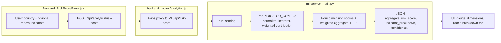
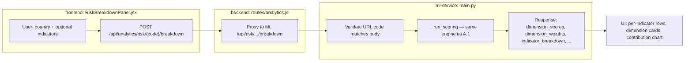

# TradeAI

## International Trade Intelligence & Simulation Platform

### Updated Project Description, Tech Stack & Functional Requirements

- **Version:** 2.0 (Revised)
- **Date:** April 2026
- **Document Type:** SRS / Project Specification

---

## 1. Project Description

### 1.1 Overview

TradeAI is a full-stack international trade intelligence and simulation platform designed to help importers, exporters, and trade analysts make data-driven decisions. The system integrates real-world macroeconomic data, commodity pricing, and exchange rates with machine-learning-powered forecasting, risk analytics, and a simulated B2B marketplace to provide an end-to-end trade decision support environment.

Unlike simple dashboards that only display static data, TradeAI combines four interconnected layers: a data visualization and analytics engine, a predictive and risk assessment module driven by concrete ML models (Prophet, GARCH, Isolation Forest), a simulated trade operations environment with an RFQ-based marketplace, and an advisory and reporting layer that synthesizes insights into actionable recommendations and downloadable reports.

### 1.2 Problem Statement

International trade decision-making requires synthesizing data from multiple fragmented sources: macroeconomic indicators from the World Bank, volatile currency exchange rates, commodity price trends, country-specific risk factors, and logistics cost estimates. Traders and analysts currently rely on disconnected spreadsheets, manual calculations, and intuition to evaluate trade viability. There is no unified platform that combines data aggregation, predictive analytics, risk scoring, and trade simulation into a single decision-support system.

### 1.3 Project Objectives

- Aggregate and visualize international trade data (import/export volumes, commodity prices, trade balances) from authoritative external sources into an interactive analytics dashboard.
- Forecast future trade volumes and currency volatility using time-series ML models, providing users with data-backed projections for planning.
- Compute transparent, multi-factor country risk scores and surface the exact metrics, weights, and indicators contributing to each score.
- Simulate the complete B2B trade lifecycle through an RFQ marketplace with order management, profitability analysis, landed cost calculation, and anomaly detection.
- Deliver real-time alerts when risk thresholds or market anomalies are detected, using WebSocket-based push notifications.
- Generate downloadable PDF intelligence reports compiling analytics, forecasts, and risk assessments for offline use and stakeholder communication.

### 1.4 Target Users

| User Role | Description | Primary Use Cases |
|---|---|---|
| Buyer | Importers or procurement analysts seeking to source commodities | Browse RFQ marketplace, submit purchase requests, evaluate profitability, view risk scores, receive alerts |
| Seller | Exporters or commodity suppliers responding to buyer demand | Respond to RFQs with quotations, manage orders, analyze market trends, assess country risk for export destinations |
| Admin | Platform administrator managing system integrity | Approve/reject payments, manage datasets (CRUD), monitor flagged anomalies, configure alert thresholds, manage users |

### 1.5 Access Tiers

Users operate under one of two access tiers, determining feature availability as defined in the RBAC matrix:

- **Free Tier:** Access to core analytics (dashboard, commodity charts, basic trade balance history), basic RFQ marketplace participation (3 RFQs/month for buyers), limited risk scoring (3 countries), and order management.
- **Premium Tier:** Full access to all features including the Comparative Intelligence Tool, Predictive Engine, AI Advisory, Profitability & Stress Simulator, PDF report generation, and unlimited RFQ and risk scoring usage. Upgrade is initiated via a payment request approved by the Admin.

---

## 2. Tech Stack

The revised tech stack addresses gaps in the original specification: the addition of an API gateway, a caching layer, a defined inter-service communication pattern, appropriate ML libraries for time-series forecasting, and real-time notification infrastructure.

| Layer | Technology | Purpose |
|---|---|---|
| Frontend | React 18 | Single-page application framework for building the interactive UI |
| Frontend | Tailwind CSS | Utility-first CSS framework for responsive, consistent styling |
| Frontend | Recharts | Charting library for trade balance time-series, commodity trends, and dashboard visualizations |
| Frontend | Socket.IO Client | WebSocket client for receiving real-time risk alerts and notifications |
| API Gateway | Nginx (Reverse Proxy) | Single entry point; routes `/api/core/*` to Node.js and `/api/ml/*` to Python; handles rate limiting and serves static frontend build |
| Backend (Core) | Node.js 20 + Express | Primary REST API handling CRUD operations, order management, RFQ marketplace, payment workflows, user auth, and RBAC middleware |
| Backend (Core) | Socket.IO Server | WebSocket server managing persistent connections for push notifications, integrated with Redis Pub/Sub |
| Backend (Core) | Bull (Job Queue) | Redis-backed job queue for async tasks: PDF report generation, batch anomaly scans, scheduled ETL triggers |
| Backend (ML) | Python 3.11 + FastAPI | Secondary API service handling all ML inference: predictions, risk scoring, anomaly detection, advisory generation |
| Backend (ML) | Facebook Prophet | Time-series forecasting model for predicting trade volumes (6-month and 12-month horizons) |
| Backend (ML) | statsmodels + arch | GARCH(1,1) model for forecasting FX (currency) volatility over 30-day and 90-day windows |
| Backend (ML) | Scikit-learn | Isolation Forest algorithm for anomaly/fraud detection on trade orders |
| Database | PostgreSQL 16 | Primary relational database storing all structured data (users, orders, trade records, RFQs, payments, risk scores, notifications) |
| Cache / Pub-Sub | Redis 7 | In-memory cache for API responses (exchange rates, prices, dashboard aggregates), session management, rate-limit counters, and Pub/Sub messaging between Node.js and Python services |
| Authentication | JWT (jsonwebtoken) + bcrypt | Stateless auth via JWT access tokens (15-min expiry) and HTTP-only refresh tokens (7-day expiry); passwords hashed with bcrypt (cost 12) |
| PDF Generation | Puppeteer | Headless Chrome for rendering HTML report templates into downloadable PDF files, executed via Bull async queue |
| External API | World Bank Data API | Source for macroeconomic indicators (GDP, inflation, current account balance) and historical trade statistics per country |
| External API | ExchangeRate API | Source for real-time and historical currency exchange rates, ingested every 6 hours via ETL |
| External API | Commodity Price API | Source for daily commodity pricing data, ingested daily via ETL into the PriceHistory table |
| DevOps | Docker + Docker Compose | Containerized deployment with 5 services (frontend/nginx, core-api, ml-api, postgres, redis) orchestrated via Compose |

### 2.1 Architecture Communication Pattern

The two backend services communicate through two defined patterns:

- **Synchronous (REST over HTTP):** For on-demand, user-facing requests. When a user requests a risk score or profitability simulation, the Node.js API calls the Python FastAPI service internally (`http://ml-api:8000`) and returns the result to the frontend. Timeout set to 10 seconds with retry (1 attempt).
- **Asynchronous (Redis Pub/Sub):** For background and batch operations. Scheduled jobs (nightly predictions, bulk anomaly scans, ETL completions) publish events to Redis channels. The Python service subscribes, processes, writes results to PostgreSQL, and publishes completion events that the Node.js server picks up for WebSocket broadcast to clients.

### 2.2 External API Resilience

External APIs are never called directly by the frontend or on-demand by user actions. All external data flows through a scheduled ETL pipeline with the following safeguards:

- **Circuit Breaker:** Each API client trips after 5 consecutive failures, serving cached data for 5 minutes before retrying.
- **Redis Caching:** Exchange rates cached with 6-hour TTL, commodity prices with 24-hour TTL, dashboard aggregates with 1-hour TTL.
- **Fallback:** If an API is unreachable, the system serves the last known data and flags it as stale in the UI.

---

## 3. Functional Requirements

The following functional requirements are organized into four modules plus an Admin Panel. Redundancies from the original specification have been consolidated (Features 3 & 17 merged; Features 11 & 19 merged), resulting in 17 distinct functional requirements. Each requirement includes its technical specification and the responsible team member.

### Module 1 — Trade Intelligence & Data Management

This module covers data visualization, marketplace operations, and administrative data management.

#### F1. Integrated Trade Analytics Dashboard

- **Owner:** Zarif Latif & Md. Faisal Bin Kamal

The system shall provide a centralized, interactive dashboard that visualizes country-wise import/export rankings. The dashboard shall display aggregate trade statistics in sortable tables and bar/line charts, allow filtering by year, region, and commodity category, and support drill-down from country-level aggregates to individual trade records. Dashboard data shall be served from Redis-cached aggregates (1-hour TTL) computed from the TradeRecord table, ensuring sub-2-second page load times.

- **Tier Access:** Free and Premium

#### F2. Commodity Price Trend Visualization

- **Owner:** Md. Faisal Bin Kamal

The system shall feature interactive time-series charts mapping historical and current pricing data for user-selected commodities. Users shall be able to select one or more commodities from a searchable dropdown, choose a date range, and view price trends plotted as line charts with hover tooltips showing exact values and dates. Data is sourced from the PriceHistory table (indexed on commodity_id, date DESC). The chart shall support toggling between daily, weekly, and monthly aggregation granularities.

- **Tier Access:** Free and Premium

#### F3. Trade Balance Analytics with Time-Series Charts

- **Owner:** Zarif Latif
- **Note:** This feature consolidates the original Features 3 and 17, which had identical descriptions.

The system shall generate time-series charts illustrating historical trade balance trajectories (exports minus imports) for user-selected countries or regions. Time is plotted on the horizontal axis and trade balance values (in USD) on the vertical axis. The chart shall color-code surplus periods (green) and deficit periods (red), support multi-country overlay for comparison, and allow date range selection spanning the available historical data. Users can toggle between annual, quarterly, and monthly views. Data is queried from TradeRecord using the composite index (country_id, commodity_id, year).

- **Tier Access:** Free (limited to 5-year history) | Premium (full history)

#### F4. Comparative Intelligence Tool

- **Owner:** Md. Faisal Bin Kamal

The system shall feature a dual-selection analysis interface allowing users to evaluate trade volumes, pricing variations, and historical patterns between multiple selected countries and commodities side-by-side. Users select up to 4 countries and up to 3 commodities. The system renders a matrix of comparison cards showing trade volume trends, average price differentials, year-over-year growth rates, and risk score comparisons. Each comparison card links to the detailed analytics for that country-commodity pair.

- **Tier Access:** Premium only

#### F5. Payment API Integration (Admin Approval Workflow)

- **Owner:** Fariha Mehzabin

The system implements a marketplace-oriented payment workflow for tier upgrades and trade offer commitments. Buyers or sellers submit a payment request, specifying the purpose (tier upgrade or trade contract commitment). The request enters a Pending state and appears in the Admin Panel. The administrator reviews the request and clicks Approve or Reject.

Upon approval for tier upgrades: the system updates the user record (tier = Premium), issues a new JWT with updated role/tier claims, and pushes a WebSocket notification to the user confirming the upgrade. Upon approval for trade contracts: the payment status is updated to Approved and the linked order status advances to Confirmed. Rejected payments trigger a notification to the user with the admin’s reason.

Payment Status Flow: Pending -> Approved / Rejected

- **Tier Access:** Free and Premium (submission); Admin only (approval/rejection)

#### F6. Core Dataset Management (CRUD)

- **Owner:** Zarif Latif

The system shall equip authorized administrators with full Create, Read, Update, and Delete capabilities to manage foundational datasets: Countries (name, ISO code, region, macro indicators), Commodities (name, HS code, category, unit), and Trade Records (country, commodity, year, import/export values, volume). The admin CRUD interface provides a data table with inline editing, row-level Edit/Delete actions, an Add New modal with validation, and a dropdown to switch between the three dataset types. All CRUD endpoints are protected by RBAC middleware requiring Admin role.

- **Tier Access:** Admin only

#### F7. RFQ Marketplace

- **Owner:** Team

The RFQ (Request for Quotation) Marketplace implements a negotiation-driven trading system reflecting real-world B2B trade practices. Buyers submit RFQs specifying: commodity type, origin and destination countries, target quantity, delivery window, and quality specifications. These requests are published on the RFQ board, visible to all registered sellers.

Sellers browse open RFQs and respond with competitive quotations including price per unit, total price, and validity date. Buyers can receive multiple quotations per RFQ, compare them, and accept the best offer. Upon acceptance, the interaction converts into a confirmed trade deal (Order), which proceeds through the payment and approval workflow (F5). The RFQ board supports filtering by commodity, country, and status (Open/Quoted/Accepted/Expired).

RFQ Status Flow: Open -> Quoted -> Accepted -> Converted to Order | Expired

- **Tier Access:** Free (Buyers: 3 RFQs/month) | Premium (unlimited) | Sellers: respond to RFQs (Free & Premium)

---

### Module 2 — Prediction & Risk Analytics

This module covers all ML-powered features. Each feature specifies the exact algorithm, input data, and evaluation criteria.

#### F8. Dual-Factor Predictive Engine

- **Owner:** Afroza Lamia

The system shall utilize predictive modeling to forecast two factors:

- **Trade Volume Forecasting:** Uses Facebook Prophet trained on historical trade volumes (5+ years from TradeRecord, aggregated monthly per country-commodity pair). Outputs 6-month and 12-month forecasts with 80% and 95% confidence intervals. Fallback to ARIMA(p,d,q) if Prophet training fails for sparse data series. Target accuracy: MAPE < 15% on 12-month holdout test set. Retrained monthly via scheduled Bull job.
- **FX Volatility Prediction:** Uses GARCH(1,1) from the arch library, trained on daily exchange rate log-returns from the ExchangeRate table. Outputs 30-day and 90-day ahead conditional volatility estimates. Evaluated using VaR backtesting at 95% confidence. Retrained weekly with latest data.

Both models are served via the Python FastAPI service (`/api/ml/predict/volume` and `/api/ml/predict/fx-volatility`). The Node.js core API calls these endpoints synchronously when a user requests a forecast, with a 10-second timeout.

- **Tier Access:** Premium only

#### F9. Automated Risk Scoring

- **Owner:** Afroza Lamia

The system shall automatically compute and assign an aggregate country risk score (0–100 scale) based on three weighted sub-scores:

- **Macroeconomic Index (40%):** Inputs: GDP growth rate, inflation rate, current account balance, sovereign credit rating proxy. Each indicator is min-max normalized across all countries and combined via weighted sum.
- **Trade Stability Score (35%):** Inputs: 5-year trade volume coefficient of variation (CoV), export concentration index (Herfindahl-Hirschman Index), trade partner diversity count. Computed via statistical variance analysis on TradeRecord data.
- **Market Volatility Score (25%):** Inputs: FX volatility forecast (from GARCH in F8), commodity price volatility (rolling 90-day standard deviation), recent anomaly frequency for that country. Computed from ExchangeRate, PriceHistory, and Order tables.

Formula: Risk Score = (0.40 × Macro) + (0.35 × Stability) + (0.25 × Volatility). Scores > 70 = Critical risk, 50–70 = Warning, < 50 = Normal.

Upon user input of a country and commodity code, the system fetches all relevant data from PostgreSQL, processes it through the scoring model on the Python service, stores the result in the RiskScore table, and returns it to the frontend. Risk scores are cached in Redis (12-hour TTL).

- **Tier Access:** Free (3 countries/month) | Premium (unlimited)

#### F10. Risk Interpretability Panel

- **Owner:** Afroza Lamia

The system shall feature a transparent diagnostic interface that breaks down a country’s computed risk score into its contributing factors. For each risk score displayed, the panel shows: the three sub-scores (Macroeconomic, Trade Stability, Market Volatility) with their individual values, the weight applied to each, the specific input indicators and their raw values, a visual breakdown (stacked bar chart or radar chart) showing relative contribution, and historical trend of the risk score over the last 12 months.

This feature ensures that risk assessments are not opaque “black box” outputs but rather explainable and auditable.

- **Tier Access:** Same as F9 (linked)

---

### Module 3 — Trade Operations & Decision Layer

This module covers the simulated trading environment, including order lifecycle, profitability analysis, and fraud detection.

#### F11. Simulated Order Management Workflow

- **Owner:** Fariha Mehzabin

The system shall facilitate an end-to-end simulated trading environment enabling users to create, modify, track, and manage the complete lifecycle of mock trade orders. Orders are created when a buyer accepts a seller’s quotation from the RFQ marketplace (F7) or manually via the order creation form.

Order Status Flow: Draft -> Submitted -> Payment Pending -> Confirmed -> In Transit (simulated) -> Delivered -> Settled | Cancelled

Each order record includes: buyer ID, seller ID, commodity, origin/destination countries, quantity, agreed price, status, anomaly flag, and timestamps. Users can view their order history with filtering by status, date range, and commodity. Sellers see incoming orders; buyers see outgoing orders.

- **Tier Access:** Free and Premium

#### F12. Profitability & Stress Simulator

- **Owner:** Fariha Mehzabin
- **Note:** This feature consolidates the original Feature 11 (Dynamic Profitability Simulator) and Feature 19 (Stress Test Calculator).

Once a buyer places an order and payment is approved, the system calculates projected profit margins by combining: commodity base price (from the order/marketplace), trade quantity, current exchange rate (from Redis cache), applicable tariff rates (configurable per country pair), estimated freight and insurance costs (from the landed cost module F14).

**Profitability Mode:** Displays projected revenue, total costs, and net profit/loss for the trade at current market conditions.

**Stress Test Mode:** Users adjust sliders to simulate adverse scenarios: FX rate fluctuation (±5–20%), commodity price shock (±10–30%), tariff increase (0–15%), and freight cost surge (0–25%). The system instantly recalculates net profit under the stressed conditions and displays a comparison chart (baseline vs. stressed) showing the impact on margins.

The simulator also uses marketplace-derived data (country-wise trade quantities and average pricing) to benchmark the user’s deal against market averages, flagging deals that fall below the 25th percentile profitability.

- **Tier Access:** Premium only

#### F13. Anomaly & Fraud Detection

- **Owner:** Zarif Latif

The system shall continuously monitor trade order inputs and automatically flag anomalous transactions using a two-stage detection pipeline:

- **Stage 1 — Statistical Rules (instant):** Flags orders where quantity or price exceeds 3 standard deviations from the historical mean for that commodity-country pair. Computed against TradeRecord aggregates. This catches obvious outliers with near-zero latency.
- **Stage 2 — Isolation Forest (ML):** A Scikit-learn Isolation Forest model trained on historical order features: quantity, unit price, country pair, commodity category, time of submission. Contamination parameter = 0.05. Orders with anomaly score < -0.5 are flagged. Model is retrained weekly on the latest order data.

Both stages run synchronously when a new order is created. If either stage triggers, the order is saved with `anomaly_flag = true` and a notification is pushed to all admin users via WebSocket. Flagged orders appear in the Admin Panel’s Orders & Anomalies section with Dismiss (false positive) and Escalate (block order) actions.

- **Tier Access:** Detection is automatic for all orders; Admin panel for review is Admin only

---

### Module 4 — Settlement, Reporting & Advisory

This module covers post-trade analysis, intelligent recommendations, reporting, and real-time alerting.

#### F14. Landed Cost & Settlement Simulation

- **Owner:** Fariha Mehzabin

Following payment confirmation and administrative approval, the system calculates the total landed cost of a trade by aggregating: base commodity price (from the confirmed order), freight charges (configurable per trade route, based on origin-destination country pair), insurance costs (percentage of commodity value, configurable), customs duties and tariffs (percentage based on commodity HS code and destination country regulations), and port handling / documentation fees (flat rate per shipment, configurable).

The landed cost breakdown is displayed as an itemized table alongside a waterfall chart showing how each cost component adds to the final settlement amount. This simulates the real-world financial obligation in international trade and helps users evaluate total cost feasibility before and after order confirmation.

- **Tier Access:** Free and Premium

#### F15. AI-Driven Advisory Engine

- **Owner:** Afroza Lamia

The system shall generate automated, actionable trade recommendations by synthesizing outputs from the Predictive Engine (F8) and Risk Scoring Engine (F9). The advisory engine is a rule-based recommendation system enhanced with ML-derived inputs (not a standalone AI model). It produces three types of recommendations:

- **Optimal Execution Windows:** Uses Prophet’s trend and seasonality decomposition to identify months with historically lowest commodity prices. Output: “Based on 5-year seasonal patterns, [commodity] prices are typically 12% lower in March–April.”
- **Alternative Market Routing:** Queries risk scores across all countries for a given commodity and identifies lower-risk origins/destinations with comparable trade volumes. Output: “Vietnam (risk: 38) offers similar export volume to [selected country] (risk: 72) with significantly lower risk.”
- **FX Timing Advice:** Uses GARCH volatility forecasts to identify periods of low predicted FX volatility as favorable transaction windows. Output: “USD/BDT volatility is forecast to drop 15% in the next 30 days — consider executing FX conversion then.”

Recommendations are generated on-demand when a user views a specific country-commodity pair and are displayed as a card-based advisory panel alongside the analytics views.

- **Tier Access:** Premium only

#### F16. Automated Intelligence Reporting

- **Owner:** Team (Support)

The system shall allow users to compile current market analytics, forecasts, and risk assessments into professional, downloadable PDF reports. Users configure the report by selecting: countries and commodities to include, report sections (analytics summary, price trends, trade balance, risk scores, forecasts, advisory recommendations), and date range for historical data.

Report generation is handled asynchronously: the request is pushed to a Bull job queue, processed by a worker that renders an HTML template with Recharts-generated chart images and data tables, and converts it to PDF via Puppeteer. The user is notified via WebSocket when the report is ready for download. Generated reports are stored for 30 days and accessible from the Admin Panel’s Reports section (admin can view all reports) or from the user’s own report history.

Target: Report generation completes in < 15 seconds for a standard 10-page report.

- **Tier Access:** Premium only

#### F17. Real-Time Risk Notification System

- **Owner:** Md. Faisal Bin Kamal

The system shall feature a global alert mechanism accessible via a UI bell icon that immediately notifies users when critical risk thresholds, market anomalies, or volatile trade conditions are detected. The notification system is powered by the following architecture:

- **Detection:** The Python ML service evaluates risk scores, FX volatility, and anomaly flags against admin-configured thresholds. When a threshold is breached, it publishes an alert event to the Redis ‘alerts’ Pub/Sub channel.
- **Delivery:** The Node.js server subscribes to the Redis ‘alerts’ channel and emits the event to the relevant user’s Socket.IO room. The React client receives the event and displays a toast notification + increments the bell icon badge.
- **Persistence:** All notifications are written to the Notification table (`user_id`, `type`, `message`, `severity`, `read`, `created_at`) for historical viewing. The bell icon dropdown shows the latest 20 notifications with unread count from a Redis counter (`notification:unread:{user_id}`).
- **Alert Types:** Critical risk score (> 70), Warning risk score (50–70), FX volatility spike (> admin threshold), Anomalous order flagged, Payment status change, Report ready for download.

Admins can configure numeric thresholds for critical/warning risk scores and FX volatility via the Admin Panel’s Risk & Alerts section. Active alerts appear below with dismiss buttons.

- **Tier Access:** Free and Premium (all users receive alerts relevant to their activity)

---

## Admin Panel

The Admin Panel is a dedicated, role-restricted interface providing system oversight and management. It is accessible only to users with the Admin role and comprises the following sections:

| Section | Description | Linked Feature(s) |
|---|---|---|
| Dashboard Overview | Summary statistics: total registered users, pending payment requests, flagged anomalous orders, total trade records. Quick-action links to each management section for urgent items. | — |
| Dataset CRUD | Tabbed interface to manage Countries, Commodities, and Trade Records. Full inline edit/delete per row, Add New modal with field validation. Dropdown to switch between dataset types. | F6 |
| User Management | View all registered users with columns: name, email, role (Admin/Buyer/Seller), tier (Free/Premium), registration date. Filterable by role and tier. Admin can manually upgrade/downgrade user tiers. | F5 |
| Payment Requests | List of pending payment requests submitted by buyers and sellers. Each row shows: user, purpose (tier upgrade / trade contract), amount, submission date, status. Admin clicks Approve or Reject. On approval for tier upgrades, the UI immediately shows “Tier upgraded” confirmation. | F5 |
| Orders & Anomalies | Flagged anomalous orders displayed at the top with Dismiss (mark as false positive) and Escalate (block order) actions. Below: all orders sortable by status, date, and anomaly flag. Clicking an order shows full details including the anomaly detection report (which stage flagged it and why). | F11, F13 |
| Risk & Alerts | Admin sets numeric thresholds for: Critical risk score cutoff, Warning risk score cutoff, FX volatility alert threshold. Active alerts appear below with dismiss buttons. Threshold changes trigger a re-evaluation of all active risk scores against the new thresholds. | F9, F17 |
| Reports | Admin can configure and generate PDF reports (same interface as F16). Additionally, admin can view and download all previously generated reports across all users. Reports are retained for 30 days. | F16 |

---

## 4. Feature Summary Matrix

The following table provides a consolidated view of all 17 functional requirements with their module, owner, tier access, and key technical components.

| ID | Feature Name | Module | Owner | Tier | Key Tech |
|---|---|---|---|---|---|
| F1 | Trade Analytics Dashboard | M1 | Zarif / Faisal | Free+Premium | Recharts, Redis cache |
| F2 | Commodity Price Trends | M1 | Faisal | Free+Premium | Recharts, PriceHistory index |
| F3 | Trade Balance Analytics | M1 | Zarif | Free (ltd) / Premium | Time-series chart, TradeRecord index |
| F4 | Comparative Intelligence | M1 | Faisal | Premium | Multi-select comparison matrix |
| F5 | Payment API (Admin Approval) | M1 | Fariha | All / Admin | JWT re-issue, WebSocket notify |
| F6 | Dataset CRUD | M1 | Zarif | Admin | Express RBAC middleware |
| F7 | RFQ Marketplace | M1 | Team | Free (ltd) / Premium | RFQ + Quotation tables |
| F8 | Predictive Engine | M2 | Afroza | Premium | Prophet, GARCH, FastAPI |
| F9 | Risk Scoring | M2 | Afroza | Free (ltd) / Premium | 3-factor weighted model |
| F10 | Risk Interpretability | M2 | Afroza | Same as F9 | Breakdown charts, radar/bar |
| F11 | Order Management | M3 | Fariha | Free+Premium | Status FSM, order lifecycle |
| F12 | Profitability & Stress Sim | M3 | Fariha | Premium | Sliders, baseline vs stress chart |
| F13 | Anomaly Detection | M3 | Zarif | Auto / Admin | Isolation Forest, Z-score rules |
| F14 | Landed Cost Simulation | M4 | Fariha | Free+Premium | Waterfall chart, cost itemization |
| F15 | AI Advisory Engine | M4 | Afroza | Premium | Rule-based + ML synthesis |
| F16 | PDF Reports | M4 | Team | Premium | Bull queue, Puppeteer |
| F17 | Real-Time Notifications | M4 | Faisal | Free+Premium | Socket.IO, Redis Pub/Sub |

---

## Appendix: Risk score & risk interpretability (end-to-end implementation)

This section documents the **as-implemented** request path in the current repository for **F9 (Automated Risk Scoring)** and **F10 (Risk Interpretability Panel)**. It supplements the target architecture elsewhere in this document (e.g. PostgreSQL, Redis cache, 3 macro/trade/volatility blocks). The codebase uses **MongoDB**, **Node.js/Express** as an ML proxy, and **Python/FastAPI** for scoring. Core logic: `ml-service/main.py` — `INDICATOR_CONFIG`, `DIMENSION_WEIGHTS`, and `run_scoring()`. Missing indicator fields are assigned a neutral mid-score in ML.

### A.1 Risk score flow (UI: `/risk`)

`frontend/src/components/RiskScorePanel.jsx` → `POST /api/analytics/risk-score` → `backend/routes/analytics.js` (proxy) → `POST http://127.0.0.1:8000/api/risk-score` → `run_scoring()`.

### A.2 Risk interpretability flow (UI: `/risk/breakdown`)

`frontend/src/components/RiskBreakdownPanel.jsx` → `POST /api/analytics/risk/:country/breakdown` → proxy → `POST /api/risk/{country_code}/breakdown` → same `run_scoring()`; response adds `dimension_scores` and `dimension_weights` for the explainability UI. URL `country_code` must match the body `country_code`.

### A.3 Optional DB-assisted shortcut

`GET /api/analytics/risk/:country` loads a `Country` from MongoDB, builds a small indicator payload (e.g. inflation, trade balance, placeholder GDP growth), and forwards to `POST /api/risk-score` — useful for quick country-code lookups without manual indicator entry.

### A.4 Related files (quick reference)

| Role | Path |
|------|------|
| ML scoring + breakdown API | `ml-service/main.py` |
| HTTP proxy + `GET` shortcut | `backend/routes/analytics.js` |
| Risk score UI | `frontend/src/components/RiskScorePanel.jsx` |
| Risk explain UI | `frontend/src/components/RiskBreakdownPanel.jsx` |
| Advisory (uses risk) | `backend/routes/advisory.js` |

---

## End of Document
